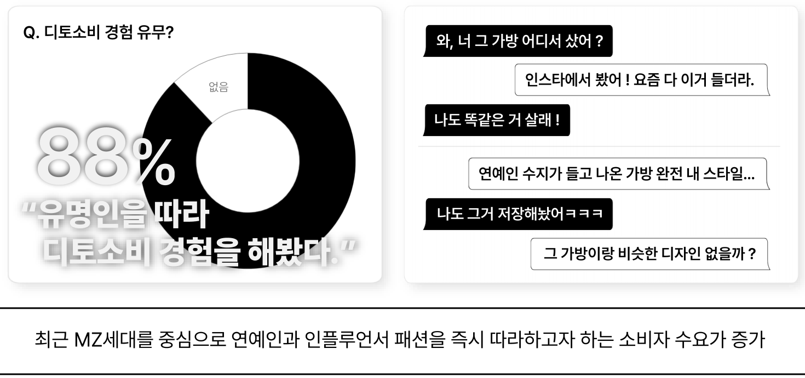
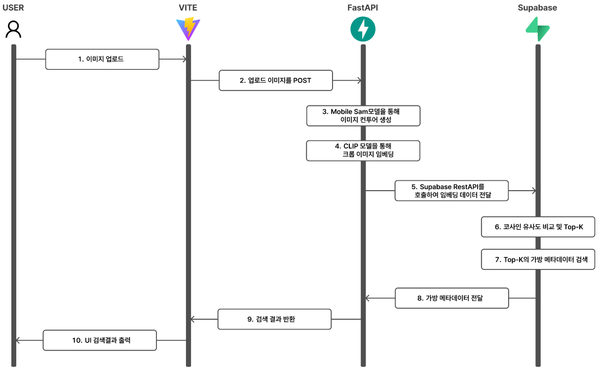
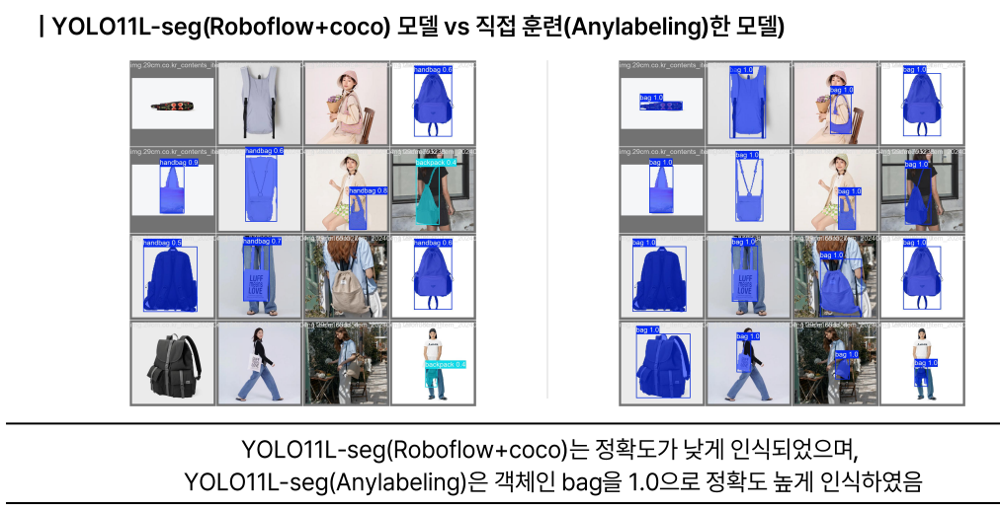
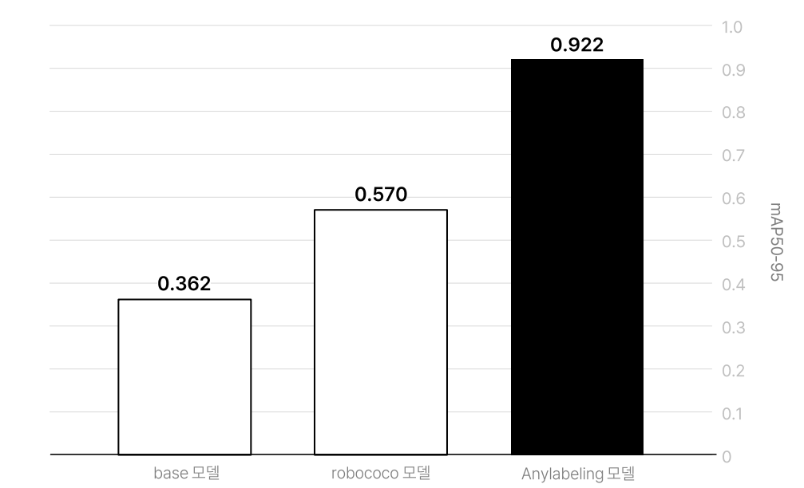
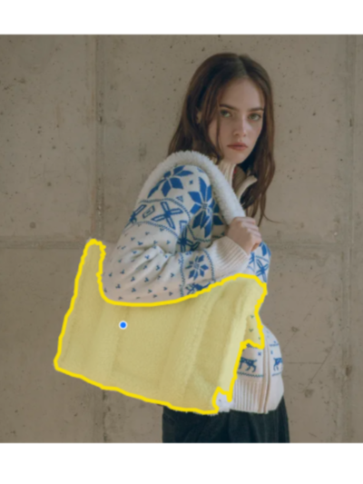
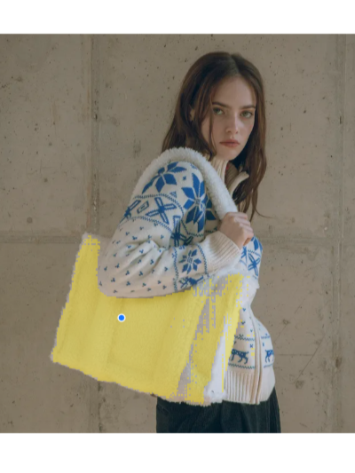
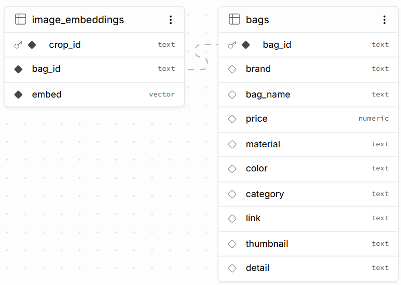

# BagFinder


> **사진 속 가방을 클릭하면 객체 영역을 분리하고, 3만 개 이상의 상품에서 유사한 가방을 찾아주는 AI Visual Search 서비스**


상품명이나 정확한 검색어를 몰라도 **이미지 자체를 검색 의도**로 사용할 수 있도록 설계했습니다.


**Live** · [Frontend](https://bag-finder-tan.vercel.app) · [Backend](https://bagfinder-production.up.railway.app)


### Key Results

| | Result |
|---|---:|
| Products | **32,309** |
| Image Embeddings | **99,458** |
| YOLO mask mAP50-95 | **0.362 → 0.922** |
| SAM `/predict` | **33.2s → 0.53s** |


<br><br>


---


## 1. Why BagFinder?


연예인·인플루언서의 착장처럼 **모습은 알지만 상품명은 모르는 제품**은 텍스트만으로 검색하기 어렵습니다.


BagFinder는 검색어를 입력하는 대신, 사진 속 원하는 가방을 직접 선택해 시각적으로 유사한 상품을 찾도록 설계했습니다.





단순 이미지 검색이 아니라, **비정형 사용자 이미지를 검색 가능한 표현으로 바꾸고**, 대규모 상품 카탈로그와 같은 embedding 공간에서 연결하는 것이 목표였습니다.


<br><br>


---


## 2. Search Pipeline





```text
Image Upload
    ↓
MobileSAM Image Encode  (/session, once)
    ↓
User Click
    ↓
Mask Decode             (/predict)
    ↓
Pixel Mask  →  UI Contour
    ↓
Mask Crop + white background
    ↓
CLIP Embedding          (/search)
    ↓
pgvector Top-K
    ↓
Similar Products
```


- `/session`: `MobileSAMModel.encode_image()` 1회 → 세션 캐시 (`backend/main.py`, `backend/models/mobile_sam_model.py`)
- `/predict`: cached embedding으로 `predict_mask()` decode만 수행
- UI용 Contour: `extract_contours()` / `simplify_contours()` (`backend/utils/contour_utils.py`, AnyLabeling 스타일 이진화·외곽선)
- 검색용 Crop: 세션에 저장한 **pixel mask**로 bbox + 마스크 외 흰색 배경 처리 후 CLIP (`/search` in `backend/main.py`)
- 필터: `sess["clip_embedding"]` 재사용 (`backend/services/similarity_filter_service.py`)


<br><br>


---


## 3. Product Image Segmentation


약 10만 장의 상품 이미지에서 가방 영역을 자동으로 추출하기 위해 **YOLO11L-Seg**를 파인튜닝했습니다.


공개 데이터로 학습한 모델은 실제 쇼핑몰 이미지에서 성능이 충분하지 않았습니다.  
데이터 분포를 비교해 **공개 데이터와 실제 상품 이미지 간 Domain Mismatch**를 원인으로 판단했습니다.


8개 카테고리의 실제 상품 이미지 **2,901장**을 직접 라벨링·검수하여 재학습했습니다.





### Model Evaluation


모델마다 클래스 구성이 달라(`handbag` / `backpack` / `bag`), 동일 조건 비교를 위해 **200장 독립 테스트셋 + 커스텀 평가**로 mask mAP50-95를 맞췄습니다.  
(평가 스크립트는 별도 실험 환경에서 수행했으며, 이 레포의 서빙 코드와는 분리되어 있습니다.)


| Model | mask mAP50-95 |
|---|---:|
| YOLO11L-Seg Base | 0.362 |
| Roboflow + COCO | 0.570 |
| **Custom Dataset** | **0.922** |





<br><br>


---


## 4. Click-to-Search with MobileSAM


사용자 이미지는 상품 이미지와 달리 배경·사람·여러 객체가 포함될 수 있어, **사용자가 검색할 가방을 직접 클릭해 지정**하도록 했습니다.


BagFinder에서는 가방의 시각적 특징만 임베딩해야 했기 때문에, Bounding Box보다 배경 포함을 줄일 수 있는 **pixel-level segmentation**이 적합하다고 판단했습니다.


```text
User Click
   ↓
MobileSAM decode
   ↓
Pixel Mask  (검색·저장)
   ↓
Contour     (UI 오버레이, AnyLabeling-style)
   ↓
Mask Crop → CLIP
```


| Contour Overlay | Pixel Mask |
|---|---|
|  |  |


구현: `predict_mask()` → PNG 마스크 저장 → `extract_contours()`로 프론트 표시용 Contour.  
검색 단계는 Contour가 아니라 **저장된 mask**로 crop합니다 (`backend/main.py` `/predict`, `/search`).


<br><br>


---


## 5. Serving Optimization


Railway CPU에서 기존 Ultralytics MobileSAM `.pt`는 `/predict` 평균 **33.2초**였습니다.


**Before:** PyTorch `.pt`, 클릭마다 전체 SAM inference  
**After:** ONNXRuntime + image embedding session cache + CLIP embedding reuse


```text
.pt → ONNXRuntime          (backend/models/mobile_sam_model.py)
SAM encode → session cache (POST /session, reuse_embedding)
CLIP embed → session reuse (sess["clip_embedding"])
```


### Latency


동일 이미지·클릭 기준 rollback A/B (`n=5` avg).


| | Before | After | Speed-up |
|---|---:|---:|---:|
| SAM `/predict` | 33.2s | **0.53s** | **~62×** |
| Session + Predict | 34.2s | **1.9s** | **~18×** |
| Filter Search | 27.0s | **1.2s** | **~23×** |


- [`before_pt.json`](_bench_assets/before_pt.json)
- [`after_onnx.json`](_bench_assets/after_onnx.json)


<br><br>


---


## 6. Database





| Table | Role |
|---|---|
| `bags` | 상품 메타데이터 |
| `image_embeddings` | 상품 이미지 CLIP vector + `bag_id` |


```text
Bag
 ├── Image Embedding
 ├── Image Embedding
 └── Image Embedding
```


하나의 상품에 여러 이미지·촬영 각도의 embedding을 연결하고, **99,458개 vector**를 대상으로 유사도 검색합니다.


- 검색: Supabase RPC `match_embeddings` (cosine similarity, `backend/main.py` `/search`)
- 결과 단계에서 `bag_id` 기준 dict로 묶어 **상품 단위 중복을 제거**한 뒤 Top 결과 구성


<br><br>


---


## 7. Tech Stack


| Layer | Technology |
|---|---|
| Frontend | Vite · React · TypeScript |
| Backend | FastAPI · Python 3.11 |
| User Segmentation | MobileSAM · ONNXRuntime |
| Product Segmentation | YOLO11L-Seg |
| Embedding | CLIP ViT-B/32 · 512-d |
| Vector DB | Supabase Postgres · pgvector |
| Deploy | Vercel · Railway |


<br><br>


---


## 8. API


| Method | Endpoint | Description |
|---|---|---|
| `POST` | `/session` | Upload + SAM encode |
| `POST` | `/predict` | Click → Mask (+ Contour for UI) |
| `POST` | `/search` | Mask crop → CLIP → `match_embeddings` |
| `POST` | `/filter-search-with-similarity` | Cached CLIP + filters |


<br><br>


---


## 9. Local Setup


### Backend

```bash
cd backend
pip install -r requirements.txt
cp ../env.example .env
uvicorn main:app --reload --port 8000
```


### Frontend

```bash
cd frontend
npm install
npm run dev
```


환경 변수는 [`env.example`](env.example)을 참고하세요.
