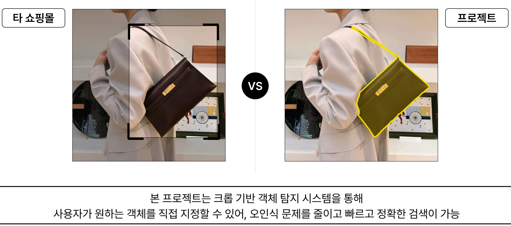
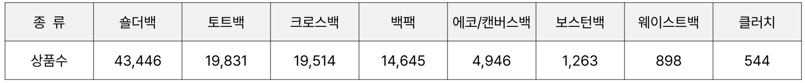
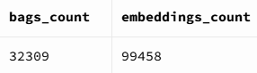
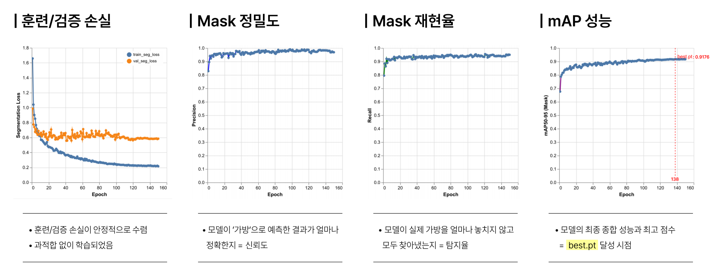

# Bag Finder

클릭 한 번으로 사진 속 가방을 잘라내고, 비슷한 상품을 찾아주는 AI 비주얼 서치 웹 서비스입니다.

**Live**
- Frontend: [Vercel](https://bag-finder-tan.vercel.app)
- Backend: [Railway](https://bagfinder-production.up.railway.app)

---

## 왜 만들었나

연예인·인플루언서 패션을 바로 따라 사고 싶은 **디토소비** 수요가 큽니다.  
“그 가방이랑 비슷한 디자인 없을까?”라는 질문에, 텍스트 검색만으로는 답이 어렵습니다.


일반 쇼핑몰의 박스(bbox) 탐지는 배경까지 같이 잡히기 쉽습니다.  
이 프로젝트는 **사용자가 클릭으로 객체를 직접 지정**하고, **픽셀 단위 마스크로 크롭**한 뒤 유사 상품을 검색합니다.



---

## 데모 — Mobile SAM 클릭 세그멘테이션

파란 점 = 사용자 클릭(+), 노란 영역 = 예측 마스크

| Contour 오버레이 | Pixel 마스크 |
|------------------|--------------|
|  |  |

---

## 시스템 아키텍처

| 계층 | 기술 |
|------|------|
| Frontend | Vite + React + TypeScript |
| Backend | FastAPI (Python 3.11) |
| SAM | MobileSAM **ONNXRuntime** (CPU) |
| Embedding | CLIP ViT-B/32 (512-d) |
| DB | Supabase Postgres + **pgvector** |
| Deploy | Vercel (FE) + Railway (BE) |


1. 이미지 업로드 → `/session`에서 SAM **image encode 1회** 후 세션 캐시  
2. 클릭 → `/predict`에서 **decode만**으로 마스크 생성  
3. 검색 → 마스크 영역 크롭 → CLIP 임베딩 → pgvector Top-K  
4. 필터 → 세션에 저장한 CLIP 벡터 재사용 (재임베딩 없이 메타/유사도 필터)

---

## 데이터셋 · DB

### 수집 카테고리 (원천 상품 규모)



### 서빙 DB 스키마


| 테이블 | 역할 |
|--------|------|
| `bags` | 상품 메타 (브랜드, 가격, 색상, 썸네일, 링크 등) |
| `image_embeddings` | 크롭 이미지 CLIP 벡터 (`vector`) + `bag_id` FK |



| | count |
|--|------:|
| `bags` | **32,309** |
| `image_embeddings` | **99,458** |

가방 1개당 여러 크롭/앵글 임베딩을 두는 구조입니다.

---

## 파이프라인 개선 (YOLO → 임베딩 DB)

상품 이미지를 DB에 넣기 전, **가방 영역만** 안정적으로 잘라내기 위해 YOLO11L-seg를 파인튜닝했습니다.

### mAP50-95 비교


| 모델 | mAP50-95 |
|------|---------:|
| base | 0.362 |
| Roboflow+COCO | 0.570 |
| **AnyLabeling 파인튜닝** | **0.922** |

### 정성 비교 (COCO 라벨 vs bag 단일 클래스)


### 학습 곡선 (best ≈ epoch 138, mAP **0.9178**)



---

## 서빙 성능 개선 (Railway, n=5 avg)

같은 이미지·같은 클릭으로 **일시 롤백 A/B** 측정.

| 구간 | Before (Ultralytics `.pt`) | After (ONNX + 캐시 / CLIP 재사용) | 배속 |
|------|---------------------------:|----------------------------------:|-----:|
| SAM `/predict` (client) | **33.2 s** | **0.53 s** | ~62× |
| SAM session + predict | **34.2 s** | **1.9 s** | ~18× |
| 필터 `/filter-search-with-similarity` | **27.0 s** | **1.2 s** | ~23× |

**핵심**
1. **`.pt` → ONNX** + Railway CPU에서 클릭당 전체 재추론 제거  
2. **`/session` encode 1회 → `/predict` decode만** (embedding 캐시)  
3. **검색 CLIP 임베딩을 세션에 재사용**해 필터 시 재계산 제거  

> 참고: `/search` 첫 CLIP+벡터 조회는 여전히 수 초~수십 초 걸릴 수 있습니다. 클릭 마스크와 필터 경로가 체감 병목이었습니다.

원본 벤치 JSON: `_bench_assets/before_pt.json`, `_bench_assets/after_onnx.json`

---

## 로컬 실행 (요약)

```bash
# Backend
cd backend
pip install -r requirements.txt
cp ../env.example .env   # SUPABASE_*, MODEL_PATH 등
uvicorn main:app --reload --port 8000

# Frontend
cd frontend
npm install
# .env: VITE_API_URL=http://127.0.0.1:8000
npm run dev
```

자세한 환경 변수는 [`env.example`](env.example)을 참고하세요.

---

## API (핵심)

| Method | Path | 설명 |
|--------|------|------|
| `POST` | `/session` | 업로드 + SAM encode, `session_id` |
| `POST` | `/predict` | 클릭 마스크 (기본 `reuse_embedding=true`) |
| `POST` | `/search` | 마스크 크롭 → CLIP → Top-K |
| `POST` | `/filter-search-with-similarity` | 세션 CLIP 재사용 필터 검색 |

벤치마크용: `reuse_embedding=false` 로 클릭마다 encode 강제 가능.

---

## 폴더 구조

```
bag_finder/
├── frontend/          # Vite React
├── backend/           # FastAPI + MobileSAM + CLIP
├── docs/readme/       # README 이미지
├── scripts/           # 벤치 스크립트
└── env.example
```

---

## 라이선스 / 모델

- MobileSAM / CLIP / YOLO 등은 각 원본 라이선스를 따릅니다.
- 상품 이미지·메타는 수집 소스 정책을 준수해야 합니다.
